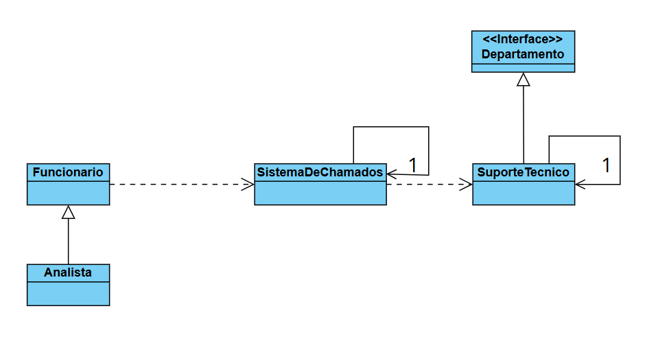

# Padrão de Projeto Mediator: Sistema de Suporte Técnico

Este projeto é uma aplicação prática do **Padrão de Projeto Comportamental Mediator (Mediador)** em Java. O objetivo é centralizar a comunicação complexa entre múltiplos "colegas" (Colleagues) em um único objeto mediador, simplificando as interações e diminuindo o acoplamento entre os componentes do sistema.

## O Padrão Mediator

O Padrão Mediator é utilizado para:

1.  **Centralizar a Comunicação:** Todos os colegas se comunicam apenas com o Mediador, e não uns com os outros.
2.  **Diminuir o Acoplamento:** As classes iniciadoras (`Funcionario`/`Analista`) não precisam saber nada sobre a classe receptora (`SuporteTecnico`), exceto que o `SistemaDeChamados` (Mediador) pode lidar com a requisição.
3.  **Gerenciar Lógica de Interação:** O Mediador (`SistemaDeChamados`) contém a lógica de como e quando as requisições devem ser encaminhadas para os receptores.

## Estrutura do Projeto

O projeto é dividido nos seguintes componentes:

| Componente (Classe) | Papel no Padrão Mediator | Descrição |
| :--- | :--- | :--- |
| `SistemaDeChamados` | **Mediator** (Mediador) | O ponto central (Singleton) que recebe todas as requisições de funcionários e as repassa para o departamento correto (`SuporteTecnico`). |
| `Funcionario` | **Colleague** (Colega Base) | A classe base que define a comunicação com o Mediator para abrir chamados, elogiar ou enviar relatórios. |
| `Analista` | **Concrete Colleague** | Herda de `Funcionario`. É um dos tipos de "colegas" que interagem com o sistema. |
| `SuporteTecnico` | **Concrete Colleague** (Receptor) | O departamento (Singleton) que recebe e processa as ações do Mediator. |
| `Departamento` | **Interface Receptor** | Define os métodos (como `receberChamado`, `receberElogio`) que qualquer departamento receptor no sistema deve implementar. |

## Diagrama de Classes

